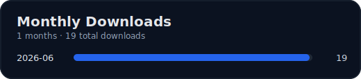

<p align="center">
  
</p>

<h1 align="center">ok-gm</h1>

<p>
一个基于图像识别的终末地自动化程序，部分功能支持后台运行，基于 <a href="https://github.com/ok-oldking/ok-script">ok-script</a> 开发。
<br />
An image-recognition-based automation tool for End Field, with background mode support, developed with <a href="https://github.com/ok-oldking/ok-script">ok-script</a>.
</p>

<p><i>通过模拟 Windows 用户接口进行操作，无内存读取、无文件修改</i></p>


<!-- Badges -->
<div align="center">


[](https://github.com/alicejump/ok-gm/releases)
[](https://github.com/alicejump/ok-gm/releases)
[](https://discord.gg/vVyCatEBgA)

</div>

## Downloads



### [English Readme](README_en.md) | 中文说明

---

## ⚠️ 免责声明

本软件为外部辅助工具，旨在自动化《学园偶像大师》的部分游戏流程。它完全通过模拟常规用户界面与游戏交互，遵循相关法律法规。本项目旨在简化用户的重复性操作，不会破坏游戏平衡或提供不公平优势，也绝不会修改任何游戏文件或数据。

本软件开源、免费，仅供个人学习与交流使用，请勿用于任何商业或营利性目的。开发者团队拥有本项目的最终解释权。因使用本软件而产生的任何问题，均与本项目及开发者无关。


**使用本软件即表示您已阅读、理解并同意以上声明，并自愿承担一切潜在风险。**

## 🚀 快速开始

1. **下载安装包**：从下方的“下载渠道”中选择一个，下载最新的 `ok-gm-win32-China-setup.exe` 安装文件。
2. **安装程序**：双击 `ok-gm-win32-China-setup.exe` 文件，并按照安装向导的提示完成安装。
3. **运行程序**：安装完成后，从桌面快捷方式或开始菜单启动 `ok-gm` 即可。

## 📥 下载渠道

* **[GitHub](https://github.com/alicejump/ok-gm/releases)**: 官方发布页，全球访问速度快。（**请下载 `setup.exe`
  安装包，而不是 `Source Code` 源码压缩包**）


## 运行要求与推荐设置

- 系统：Windows
- 游戏分辨率：推荐 9:16（1080x1920 最佳），最低 720x1280（低于该分辨率可能导致识别与定位异常）
- 语言：当前部分功能仅支持简体中文
- 运行权限：建议管理员权限运行（源码模式必须）
- 路径：安装/运行路径尽量使用纯英文
- 帧率：推荐稳定 60 FPS，用于战斗和导航任务

---


## 功能一览（按任务类型）

### 日常任务
 - 竞技场
 - 收资金
 - 买商店
 - 工作
 - 升级一次支援卡
 - 领任务


### 定时任务
- 支持将一次性任务(比如 `日常任务`)加入 Windows 任务计划，按设定时间自动启动执行

### 辅助能力
- OCR 识别、模板匹配、HSV 颜色识别
- UI 自动化、按键模拟
- 日志、异常处理、流程调度

## 🔧 疑难解答 (Troubleshooting)

如果遇到问题，请在提问前按以下步骤逐一排查：

1. **安装路径**：请确保软件安装在**纯英文路径**下（例如 `D:\Games\ok-gm`），不要安装在 `C:\Program Files` 或包含中文字符的文件夹中。
2. **杀毒软件**：将软件的安装目录添加到您的杀毒软件（包括 Windows Defender）的**信任区或白名单**中，以防文件被误删或拦截。
3. **显示设置**：
    * 关闭所有显卡滤镜（如 NVIDIA Game Filter）和锐化功能，除非部分功能要求。
    * 使用游戏默认的亮度设置。
    * 关闭任何在游戏画面上显示信息的叠加层（如 MSI Afterburner、Fraps 等显示的帧率）。
4. **自定义按键**：如果您修改了游戏内的默认按键，请务必在 `ok-gm` 的设置中进行同步配置。仅支持设置中列出的按键。
5. **软件版本**：检查并确保您使用的是最新版本的 `ok-gm`。
6. **游戏性能**：请确保游戏能稳定在 **60 FPS** 运行。如果帧率不稳定，请尝试降低游戏画质或分辨率。
7. **游戏断线**：如频繁遇到与服务器断开连接的问题，可以尝试先手动打开游戏运行5分钟后再启动本工具，或在断线后直接重新登录，不要退出游戏。
8. **寻求帮助**：如果以上步骤都无法解决您的问题，请通过社区渠道提交详细的错误报告。
9. **游戏/软件语言** 本软件目前部分功能仅支持简体中文，不支持其他语言。

---

## 💻 开发者专区

### 从源码运行 (Python)

本项目仅支持 Python 3.12 版本, 必须以管理员权限启动CMD, PyCharm, VSCode。

```bash
# 若首次 clone 未带子模块参数，请先执行
git submodule update --init --recursive

# 安装或更新依赖
pip install -r requirements.txt --upgrade

# 运行 Release 版本
python main.py

# 运行 Debug 版本
python main_debug.py
```

### 命令行参数

您可以通过命令行参数实现自动化启动。

``` pwsh
# 启动后自动执行第1个任务『日常任务』，并在任务完成后退出程序
ok-gm.exe -t 1 -e
```

* `-t` 或 `--task`: 启动后自动执行第N个任务。`1` 代表任务列表（文件 [./src/config.py](./src/config.py) 列表 `onetime_tasks`）中的第1个（也就是『日常任务』）。
* `-e` 或 `--exit`: 任务执行完毕后自动退出程序。

### 开发调试与测试

```bash
# 执行 tests/ 下全部测试脚本（PowerShell）
./run_tests.ps1

# 或逐个运行 unittest
python -m unittest tests/TestEssenceRecognizer.py
```

若你在开发“识别类任务”（OCR/模板/颜色识别），建议优先在 `main_debug.py` 下调试，配合日志与截图目录排查。

## 💬 加入我们

* **QQ 交流群**: 
* **QQ 频道**: [点击加入](https://pd.qq.com/s/djmm6l44y) (群满或获取最新资讯)
* **开发者群**:  ( **注意**:
  此群仅面向有开发能力、拥有Github账号、希望参与贡献的开发者，入群前请确保您已能够从源码成功运行项目。)

本项目基于 [ok-script](https://github.com/ok-oldking/ok-script)
框架开发，简单易维护。欢迎有兴趣的开发者使用 [ok-script](https://github.com/ok-oldking/ok-script) 开发您自己的自动化项目。

## 🔗 使用ok-script的项目：

* 终末地 [https://github.com/AliceJump/ok-end-field](https://github.com/AliceJump/ok-end-field)
* 鸣潮 [https://github.com/ok-oldking/ok-wuthering-waves](https://github.com/ok-oldking/ok-wuthering-waves)
* 鸣潮(日常一条龙-优化版) [https://github.com/zzc-tongji/ok-ww-enhanced](https://github.com/zzc-tongji/ok-ww-enhanced)
* 原神(停止维护,
  但是后台过剧情可用) [https://github.com/ok-oldking/ok-genshin-impact](https://github.com/ok-oldking/ok-genshin-impact)
* 少前2 [https://github.com/ok-oldking/ok-gf2](https://github.com/ok-oldking/ok-gf2)
* 星铁 [https://github.com/Shasnow/ok-starrailassistant](https://github.com/Shasnow/ok-starrailassistant)
* 星痕共鸣 [https://github.com/Sanheiii/ok-star-resonance](https://github.com/Sanheiii/ok-star-resonance)
* 二重螺旋 [https://github.com/BnanZ0/ok-duet-night-abyss](https://github.com/BnanZ0/ok-duet-night-abyss)
* 白荆回廊(停止更新) [https://github.com/ok-oldking/ok-baijing](https://github.com/ok-oldking/ok-baijing)

## ❤️ 赞助与致谢

### 贡献者

<a href="https://github.com/AliceJump/ok-gm/graphs/contributors">
  
</a>

### 赞助商 (Sponsors)

* **EXE 签名**: Free code signing provided by [SignPath.io](https://signpath.io/), certificate
  by [SignPath Foundation](https://signpath.org/).

### 致谢

* [ok-oldking/OnnxOCR](https://github.com/ok-oldking/OnnxOCR)
* [zhiyiYo/PyQt-Fluent-Widgets](https://github.com/zhiyiYo/PyQt-Fluent-Widgets)
* [Toufool/AutoSplit](https://github.com/Toufool/AutoSplit)
